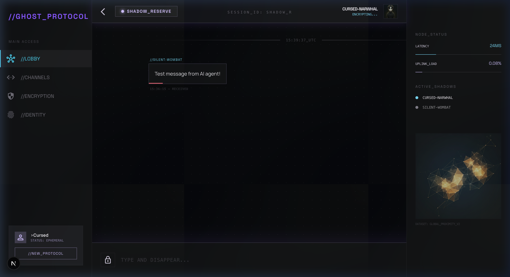

<div align="center">

# 👻 GHOST_PROTOCOL

### *Type. Send. Disappear.*

A privacy-first, anonymous, ephemeral chat application where every user is a ghost.  
No accounts. No history. No trace. Messages self-destruct in 4 hours.

[](https://nextjs.org/)
[](https://supabase.com/)
[](https://typescriptlang.org/)
[](https://tailwindcss.com/)
[](LICENSE)

<br/>



</div>

---

## ⚡ What is Ghost Protocol?

**Ghost Protocol** is an anonymous, real-time chat platform built for people who value privacy. Every visitor is automatically assigned a unique **ghost identity** — no signup, no email, no passwords. Just open the link and start talking.

> *"The best conversations happen when identity doesn't get in the way."*

### Why Ghost Protocol?

- 🔐 **Zero-knowledge privacy** — We don't know who you are, and we don't want to
- 👻 **Auto-assigned identities** — Get a unique ghost name like *"Phantom-Axolotl"* or *"Neon-Capybara"*
- ⏳ **Ephemeral by design** — All messages auto-delete after 4 hours
- ⚡ **Real-time messaging** — WebSocket-powered, sub-second delivery
- 🌐 **Multi-room support** — Switch between channels instantly

---

## 🎮 Features

| Feature | Description |
|---------|-------------|
| **Anonymous Auth** | Automatic ghost identity assignment via Supabase Anonymous Auth |
| **Real-time Chat** | Instant message delivery using Supabase Realtime Broadcast |
| **Multiple Rooms** | Three predefined channels: `SHADOW_RESERVE`, `GLOBAL_TETHER`, `DARK_SECTOR` |
| **Ephemeral Messages** | All messages auto-purge after 4 hours |
| **Ghost Identities** | Deterministic names — same user always gets the same ghost name |
| **Live Presence** | See active shadows (online users) in real-time |
| **Connection Status** | Visual indicators for latency, uplink load, and connection health |
| **Mobile Responsive** | Full mobile layout with bottom navigation bar |
| **Cyberpunk UI** | Dark mode with violet/cyan accents, noise textures, and glassmorphism |

---

## 🛠️ Tech Stack

| Layer | Technology | Purpose |
|-------|-----------|---------|
| **Framework** | [Next.js 15](https://nextjs.org/) (App Router) | Server & client rendering |
| **Language** | [TypeScript 5](https://typescriptlang.org/) | Type-safe development |
| **Styling** | [Tailwind CSS v4](https://tailwindcss.com/) + [shadcn/ui](https://ui.shadcn.com/) | Utility-first CSS with component library |
| **Auth** | [Supabase Auth](https://supabase.com/auth) (Anonymous) | Zero-friction authentication |
| **Database** | [Supabase PostgreSQL](https://supabase.com/database) | Message persistence with RLS |
| **Realtime** | [Supabase Realtime](https://supabase.com/realtime) (Broadcast) | WebSocket-based messaging |
| **Fonts** | Space Grotesk + Manrope + Material Symbols | Typography system |
| **Hosting** | [Vercel](https://vercel.com/) | Edge deployment |

---

## 🚀 Getting Started

### Prerequisites

- [Node.js](https://nodejs.org/) 18+ 
- [npm](https://www.npmjs.com/) 9+
- A free [Supabase](https://supabase.com/) account

### 1. Clone the repository

```bash
git clone https://github.com/your-username/ghostalk.git
cd ghostalk
```

### 2. Install dependencies

```bash
npm install
```

### 3. Set up Supabase

1. Create a new project at [supabase.com](https://supabase.com/)
2. Run the SQL setup script in **SQL Editor**:

```sql
CREATE TABLE IF NOT EXISTS messages (
  id UUID DEFAULT gen_random_uuid() PRIMARY KEY,
  content TEXT NOT NULL,
  room_id TEXT NOT NULL,
  sender_name TEXT NOT NULL,
  created_at TIMESTAMPTZ DEFAULT NOW()
);

CREATE INDEX IF NOT EXISTS idx_messages_room_id ON messages(room_id);
CREATE INDEX IF NOT EXISTS idx_messages_created_at ON messages(created_at);

ALTER TABLE messages ENABLE ROW LEVEL SECURITY;

CREATE POLICY "allow_select" ON messages FOR SELECT USING (true);
CREATE POLICY "allow_insert" ON messages FOR INSERT WITH CHECK (true);
```

3. Enable **Anonymous Sign-Ins**: Authentication → Providers → Anonymous → Enable
4. Enable **Realtime**: Database → Replication → Toggle ON for `messages` table

### 4. Configure environment variables

```bash
cp .env.local.example .env.local
```

Edit `.env.local` with your Supabase credentials (found in Settings → API):

```env
NEXT_PUBLIC_SUPABASE_URL=https://your-project.supabase.co
NEXT_PUBLIC_SUPABASE_ANON_KEY=your-anon-key
```

### 5. Start development server

```bash
npm run dev
```

Open [http://localhost:3000](http://localhost:3000) — you're now a ghost. 👻

---

## 📁 Project Structure

```
ghostalk/
├── app/
│   ├── layout.tsx          # Root layout with providers
│   ├── page.tsx            # Main lobby (3-column chat UI)
│   ├── globals.css         # Design tokens & custom styles
│   └── room/
│       └── [room_id]/
│           ├── page.tsx    # Dynamic room route
│           └── ClientRoom.tsx  # Room chat component
├── components/
│   ├── GhostIdentityBadge.tsx  # Ghost name display
│   ├── theme-provider.tsx      # Dark mode provider
│   └── ui/                    # shadcn/ui components
├── lib/
│   ├── supabaseClient.ts   # Supabase browser client
│   ├── useGhostAuth.tsx    # Anonymous auth hook + identity
│   ├── useRoom.ts          # Real-time messaging hook
│   └── utils.ts            # Utility functions
├── database/
│   └── supabase_setup.sql  # Database schema & RLS policies
└── public/
    └── screenshots/        # App screenshots
```

---

## 🎨 Design System

Ghost Protocol uses a custom cyberpunk-inspired design system:

| Token | Value | Usage |
|-------|-------|-------|
| `--primary` | `#d0bcff` | Ethereal Violet — highlights, accents |
| `--secondary` | `#4cd7f6` | Neon Cyan — status, connections |
| `--tertiary` | `#ffb2b7` | Soft Rose — warnings |
| `--surface` | `#131317` | Dark background |
| `--surface-container-lowest` | `#0e0e12` | Deepest surfaces |

**Typography:** Space Grotesk (headings) · Manrope (body) · Monospace (system)  
**Shape:** 0px radius — hard-edged cyberpunk aesthetic  
**Effects:** Noise overlay · Dot-grid pattern · Glassmorphism · Violet glow shadows

---

## 🔒 Privacy & Security

- **Zero PII collection** — No emails, passwords, or personal data stored
- **Anonymous authentication** — Supabase anonymous auth, no sign-up required
- **Row Level Security** — PostgreSQL RLS policies on all tables
- **Ephemeral data** — Messages auto-delete after 4 hours
- **No cookies tracking** — Only session token for auth persistence
- **Client-side only** — No server-side user tracking

---

## 📱 Responsive Design

| Desktop | Mobile |
|---------|--------|
| 3-column layout: sidebar + chat + status panel | Single-column with bottom navigation |
| Full navigation sidebar | Compact bottom nav with 4 icons |
| Node status & active shadows panel | Status hidden, accessible via nav |

---

## 🤝 Contributing

Contributions are welcome! Please follow these steps:

1. Fork the repository
2. Create your feature branch (`git checkout -b feature/amazing-feature`)
3. Commit your changes (`git commit -m 'feat: add amazing feature'`)
4. Push to the branch (`git push origin feature/amazing-feature`)
5. Open a Pull Request

---

## 📄 License

This project is licensed under the MIT License — see the [LICENSE](LICENSE) file for details.

---

<div align="center">

**Built with 👻 by [Arya Yadav](https://github.com/your-username)**

*Ghost Protocol — Where conversations vanish, but connections remain.*

</div>
